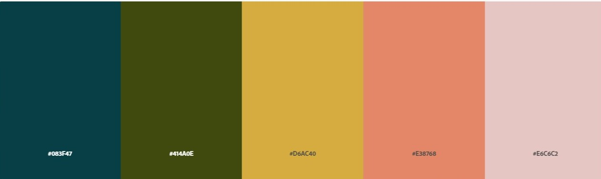
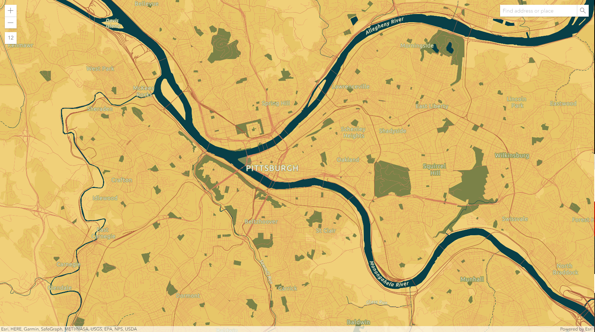
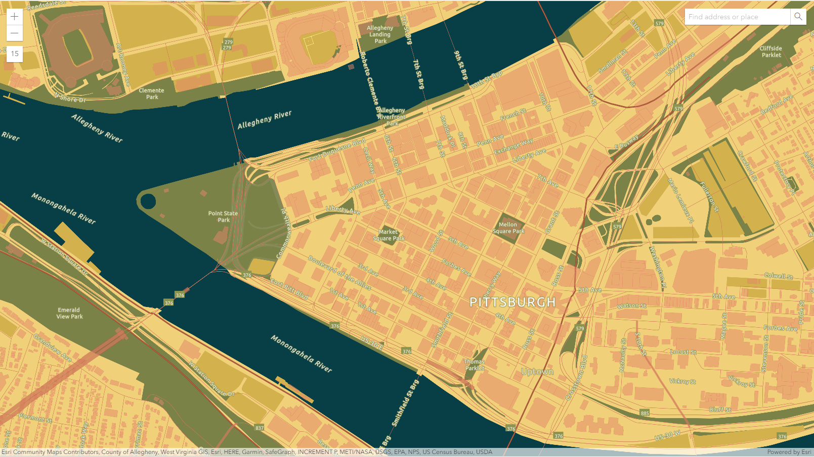
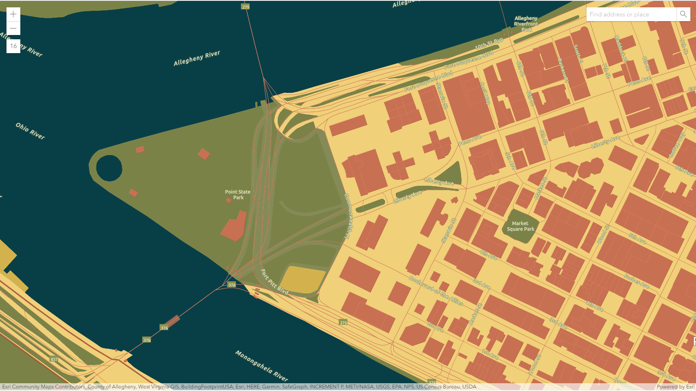

# Create a Custom ArcGIS Map Style

Tools used: [Adobe Color Trends](https://color.adobe.com/trends) and [ArcGIS Vector Tile Style Editor](https://developers.arcgis.com/vector-tile-style-editor/)

For this assignment, I decided to use another source of inspiration than last week’s because my first custom map relied on more of a monochromatic scale, and I wanted to experiment with creating a map style using different colors. For inspiration, I used a concert poster (Links to an external site.) designed by Jim Franklin for a Big Brother and the Holding Company show in San Antonio in 1968. (The concert was cancelled, but the poster is still really cool.) Using Adobe’s color trends, I found an existing palette that captured a more muted essence of the poster’s colors fairly well:

I originally selected the Colored Pencil style from ArcGIS, but after experimenting with this for a while with the color palette I had selected, I decided to switch to the Light Gray Canvas to have a more basic style that I could work with. I did this because I found that certain elements of the Colored Pencil style did not work as well with the darker, vibrant colors that were part of the palette I was working with.

I initially planned to map San Antonio because that was the location of the concert featured on the poster, but I found that the area around there did not have as much variation with water and green spaces to allow me to experiment with the design elements. Instead, I decided to visualize Pittsburgh, which had more of these elements and was still relevant to the class.

I decided to follow the principles of natural association and selected blue for water and green for nature. I then decided that the golden color would be appropriate for land. I changed the colors for the borders, roads, and buildings features until I decided which colors were best to assign to each. Additionally, I adjusted the colors slightly to make them slightly less dark than they had been in the original palette.

After making these initial decisions, I considered the map at zoom levels 12, and 15, and 16. I noted several issues at each level that would have to be addressed for the style to be useful at this level. The central issue was the visual “heaviness” of these elements, as the road lines were thick and the buildings opaque. To address this, I decreased the thickness of the roads, and I changed the opacity setting for the buildings to make them more transparent unless zoomed at level 16 or closer, both of which improved the map’s appearance. After consulting with Chris during lab, I further lightened the green color used for nature features and adjusted the visibility of more minor roads at different zoom levels to keep them from being distracting. This resulted in the final custom map (Links to an external site.):

At zoom 12:

At zoom 15:

At zoom 16:

The Google Maps style I designed is attached to this post for reference. Although I enjoyed using both, I preferred the ArcGIS platform to the Google Maps one. I found the design process more intuitive, as I was able to navigate the menus to customize the map elements more easily. Additionally, I appreciated the simplicity of simply importing the format into the familiar ArcGIS Online platform. At the same time, I would think the Google Maps style would be more easily used across other platforms through the JSON code, meaning that it may be the better or more flexible option overall.

I also made two very different maps - with the Google Maps style, I was making more of an abstract map with a non-traditional color scheme that was meant to emulate the aesthetic of an existing design. With the ArcGIS custom style, however, I was using a more traditional color scheme to build a more traditional map. This also influenced how I interacted with both tools.
