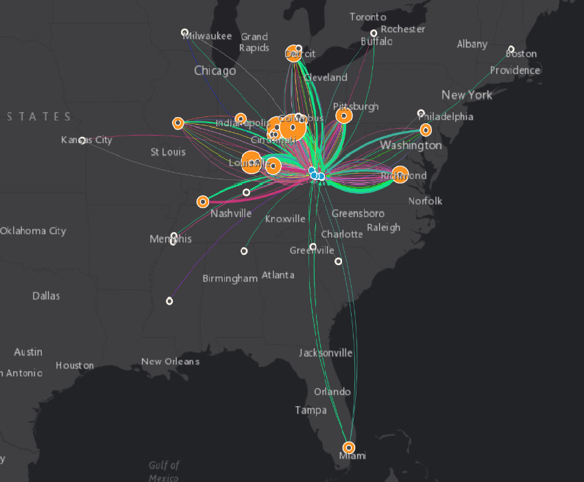

# Visualizing Pain Pill Data using ArcGIS Insights

Tools used: [ArcGIS Insights](https://www.esri.com/en-us/arcgis/products/arcgis-insights/overview)
Data: [DEA pain pill database, published by the Washington Post](https://www.washingtonpost.com/graphics/2019/investigations/dea-pain-pill-database/)

I found ArcGIS Insights to be fairly simple and intuitive to use. The "card" system was a little confusing at first, but it was helpful to have the layout of all "cards" that were part of one project. In terms of constructing the map itself, things were smooth. I liked getting to experiment with some of the different visualizations that the platform includes, as well as working with the maps.

I liked getting the opportunity to experiment with the maps and the platform's other visualization types. Below is the map I created, as well as a sample from the other visualizations I was looking at. I found this one interesting because it so starkly shows the proportion of units at the largest buyers, especially Strosnider. If I were to work on this more, it would be cool to color coordinate the map and graph to more clearly show the connections between them.

 

#### 1.  What did you learn from working with these data and performing this analysis?

There were three primary observations that I was able to make while working with this data. One was the sheer volume of pills that entered this single county, especially when phrased as it was in the article: "enough for 179 pills per person per year." That's really a staggering amount (nearly enough for everyone to take a pill every other day for the whole year), and summarizes just how much pain medication was making its way into this single county. Secondly, the mapping process provided a very clear representation of the firms providing the biggest inflows of pills to each pharmacy. The brightness and thickness of the lines vividly displayed the major routes that pills took to enter the county. Finally, the network itself was revealing, though frankly, unsurprising, and sparked further reflection on the different distribution patterns that these drugs took, and how much damage what was essentially a handful of major players caused.

#### 2.  Under what circumstances (or for what types of users) would you recommend using ArcGIS Insights?

I could imagine a pretty wide audience for ArcGIS Insights, since much of it is fairly intuitive and user-friendly. I could see ArcGIS Insights being useful when someone is looking to create a group of visualizations that includes a map to convey a story. In this case, I found it really helpful that I could plot the map while also including an additional visualization showing the pharmacies with the largest units using the same platform.

#### 3.  Can you imagine a scenario where tools like ArcGIS Insights might be preferable or a compliment to ArcGIS Pro?

I think ArcGIS Insights is more intuitive to use and has a simpler interface. I also think, as we discussed in class, that its inclusion of more tools for other types of visualizations suggests that it is Esri's "response" to Tableau. Because it has limited functionality, I could see it complementing ArcGIS Pro for instances where more complex analyses could be completed in Pro, and summary visualizations could be created using Insights. I enjoyed getting to experiment a bit with these, although in my cursory work with some of them, I wasn't sure how customizable they were. Still, it was nice that you could just put your data in one place and have the option of mapping and/or working with several other types of visualizations.
